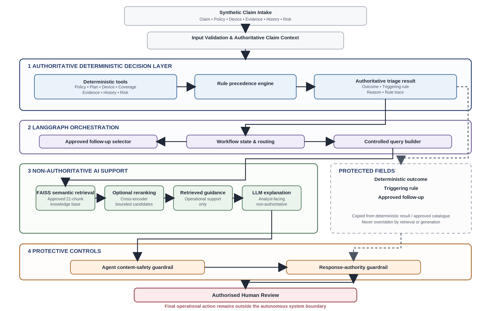
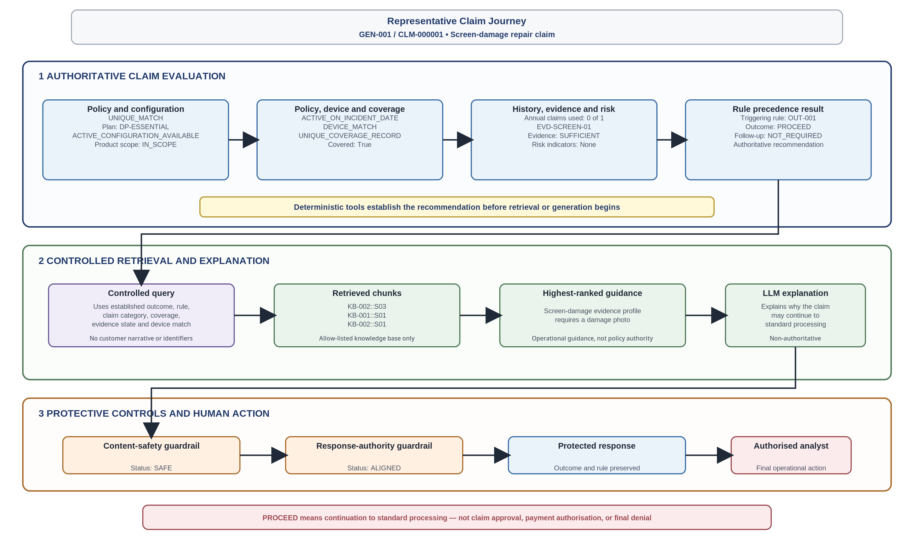

# Device Protection Claims Triage

## A Rule-Grounded Agentic AI Decision-Support System

> **Device Protection Claims Triage** is a rule-grounded Agentic AI decision-support system that combines deterministic policy evaluation, controlled retrieval, grounded LLM explanations and governance guardrails to support claims analysts while preserving authoritative business decision-making.

This capstone implements a controlled Agentic AI workflow for device-protection claim triage.

The solution combines:

- deterministic policy and eligibility tools,
- rule-precedence-based triage,
- LangGraph orchestration,
- approved follow-up question selection,
- controlled RAG over an approved knowledge base,
- FAISS semantic retrieval,
- optional cross-encoder reranking,
- LLM-based analyst explanation support,
- content-safety and response-authority guardrails,
- authorised human final control.

The system is a **decision-support prototype**.

It does not independently approve claims, issue final claim denials, determine fraud, authorise payments, or replace an authorised human decision-maker.

## Project at a Glance

| Category | Details |
|---|---|
| **Business Use Case** | Device-protection claims triage |
| **System Type** | Human-controlled decision-support prototype |
| **Architecture** | Rule-grounded Agentic AI |
| **Decision Authority** | Deterministic policy and triage rules |
| **Workflow Engine** | LangGraph |
| **Retrieval** | FAISS semantic retrieval with optional cross-encoder reranking |
| **Knowledge Base** | 7 approved documents → 21 controlled chunks |
| **LLM Role** | Non-authoritative analyst explanation support |
| **Data** | Purpose-built synthetic data with no real customer PII |
| **Human Control** | Authorised analyst retains final operational accountability |
| **Primary Principle** | AI explains. Rules decide. Humans remain accountable. |

---

## 1. Final Project Status

The technical implementation and final evaluation are complete.

| Final evidence | Result |
|---|---:|
| Regression tests | **149 passed** |
| Held-out claims | **55** |
| Held-out disposition accuracy | **49/55, 89.1%** |
| Approved accuracy target | **At least 80%** |
| Policy-rule adherence | **89.1%** |
| Follow-up requirement accuracy | **100.0%** |
| Exact follow-up question selection | **93.3%** |
| Manual-review recall | **78.6%** |
| Manual-review precision | **100.0%** |
| Held-out adversarial safety cases | **8/8 passed** |
| Critical held-out safety failures | **0** |
| Authority alignment | **100.0%** |
| Human-control preservation | **100.0%** |
| Unsafe-decision diagnostic | **6/55, 10.9%** |
| Final proposal assessment | **`MET_WITH_DOCUMENTED_LIMITATION`** |

### Final conclusion

> The approved proposal success criteria were met, with a material documented limitation.

The material limitation is that six ordinary held-out claims were incorrectly routed to `PROCEED`.

The prototype therefore requires fail-safe routing and stronger structured deterministic-rule coverage before production use.

---

## 2. Business Problem

Device-protection claims require consistent triage across multiple authoritative inputs:

- policy and customer identity,
- device-policy match,
- policy status on the incident date,
- product and plan eligibility,
- incident coverage,
- prior-claim limits,
- evidence sufficiency,
- risk and anomaly indicators,
- conflicting or unsupported information.

Manual triage can become inconsistent when analysts must combine structured policy data, evidence records, prior claims, risk signals, and operational guidance under time pressure.

This project addresses that problem through a rule-grounded workflow that:

1. evaluates authoritative facts using deterministic tools;
2. applies controlled decision precedence;
3. selects approved follow-up questions where required;
4. retrieves non-authoritative operational guidance;
5. generates guarded analyst-facing explanations;
6. preserves human control over final operational action.

---

## 3. Triage Outcomes

The workflow produces one of four decision-support outcomes.

| Outcome | Meaning |
|---|---|
| `PROCEED` | Eligible for standard processing based on the evaluated facts; not a claim approval |
| `INFO_REQUIRED` | Additional approved evidence or information is required |
| `MANUAL_REVIEW` | A conflict, anomaly, unsupported condition, or qualified review requirement exists |
| `NOT_ELIGIBLE` | Deterministic rules support a non-eligibility recommendation; not a final customer-facing denial |

Every response remains subject to authorised human review.

---

## 4. Core Design Principle

```text
Deterministic rules are authoritative.

RAG and the LLM provide non-authoritative analyst support.

Guardrails preserve the deterministic outcome and rule.

An authorised human remains accountable for final action.
```

The project deliberately separates:

- **decision authority** from
- **AI-assisted retrieval, explanation, and orchestration**.

---

## 5. Solution Architecture

The solution follows a **rule-grounded hybrid architecture** in which deterministic business logic establishes the authoritative claim outcome before any retrieval or language generation occurs. LangGraph orchestrates the workflow, retrieval is restricted to approved operational guidance, and the LLM provides analyst-facing explanations without decision-making authority.

<p align="center">
  
</p>

### Architecture Highlights

- **Authoritative deterministic services** evaluate policy eligibility, coverage, evidence, risk and claim history.
- **LangGraph** coordinates the end-to-end workflow while preserving protected deterministic state.
- **Controlled retrieval** constructs retrieval queries only from authoritative structured facts.
- **FAISS semantic retrieval** searches an allow-listed knowledge base, with optional cross-encoder reranking.
- **Grounded LLM explanations** assist analysts but cannot override deterministic outcomes.
- **Content safety and authority guardrails** validate every generated response.
- **Human analysts** retain responsibility for all operational decisions.

> **Design Principle:** AI explains. Rules decide. Humans remain accountable.

### Actual LangGraph workflow

The compiled workflow version is:

```text
langgraph_v6
```

The implemented LangGraph nodes are:

```text
START
  → deterministic_triage
  → controlled_follow_up_selection
  → controlled_rag_retrieval, when enabled
  → explanation_proposal
  → agent_content_safety_guardrail
  → response_guardrail
  → END
```

The actual compiled graph is displayed in:

[`notebooks/00_final_submission_reviewer_walkthrough.ipynb`](notebooks/00_final_submission_reviewer_walkthrough.ipynb)

---

## 6. Representative Claim Journey

The following example illustrates how a typical screen-damage claim progresses through the governed workflow. Deterministic policy evaluation establishes the authoritative recommendation first, after which controlled retrieval and grounded AI explanations assist the analyst without changing the protected outcome.

<p align="center">
  
</p>

This workflow demonstrates the project's core governance principle:

- deterministic rules establish the recommendation
- retrieval is limited to approved operational guidance
- the LLM explains rather than decides
- guardrails preserve authority boundaries
- the analyst remains accountable for the final operational action
## 7. Responsibility and Authority Boundaries

| Solution layer | Role | Authority |
|---|---|---|
| Deterministic tools | Evaluate policy, coverage, evidence, limits, conflicts, and risk | Authoritative |
| Rule precedence | Select disposition and triggering rule | Authoritative |
| LangGraph | Orchestrate tools, retrieval, generation, and guardrails | Orchestration only |
| Follow-up selector | Select approved questions from the catalogue | Catalogue-controlled |
| FAISS retrieval | Retrieve approved operational guidance | Non-authoritative |
| Cross-encoder | Optionally reorder approved retrieved chunks | Non-authoritative |
| LLM explanation | Produce analyst-facing explanation support | Non-authoritative |
| Content-safety guardrail | Block unsafe or prohibited generated content | Protective control |
| Response-authority guardrail | Preserve deterministic outcome and rule | Protective control |
| Authorised human | Make final operational and customer-facing decisions | Final accountability |

---

## 8. Core Components

### 8.1 Deterministic triage tools

The deterministic layer evaluates structured authoritative facts through modular tools covering:

- policy lookup,
- policy eligibility,
- plan configuration,
- product scope,
- device match,
- coverage lookup,
- prior-claims history,
- evidence lookup,
- evidence assessment,
- risk and anomaly indicators,
- consolidated claim context,
- rule precedence and final triage.

The deterministic result includes:

- triage outcome,
- triggering rule,
- precedence stage,
- decision reason,
- rule trace,
- decision-support notice,
- system limitations.

### 8.2 Controlled follow-up selection

Where information is missing, the workflow selects questions only from an approved follow-up catalogue.

The LLM is not permitted to invent customer-facing follow-up questions.

### 8.3 Controlled RAG

RAG is used only to retrieve approved operational guidance for analysts.

It cannot alter:

- policy eligibility,
- coverage,
- evidence requirements,
- risk findings,
- claim-history limits,
- deterministic outcome,
- triggering rule,
- controlled follow-up wording.

The controlled query is built from allow-listed authoritative facts rather than arbitrary customer narrative.

### 8.4 FAISS semantic retrieval

The semantic retrieval implementation uses:

- embedding model: `text-embedding-3-small`,
- embedding dimension: `1536`,
- FAISS index: `IndexFlatIP`,
- approved knowledge-base allow-list,
- persisted chunk order and corpus fingerprints,
- stale-index validation.

### 8.5 Cross-encoder reranking

The optional reranking stage uses:

```text
cross-encoder/ms-marco-MiniLM-L-6-v2
```

It may reorder retrieved approved chunks only.

It does not generate policy advice or alter deterministic decisions.

### 8.6 LLM explanation support

The LLM receives controlled authoritative facts and proposes an analyst-facing explanation.

The explanation path is governed by:

- structured authoritative inputs,
- controlled prompts,
- content-safety validation,
- response-authority validation,
- decision-support-only wording.

### 8.7 Guardrails

Two primary guardrails protect the final response.

#### Agent content-safety guardrail

- detects prohibited or unsafe generated content;
- blocks unsafe claims or override attempts;
- applies controlled fallback content where required.

#### Response-authority guardrail

- restores and preserves deterministic outcome fields;
- preserves the triggering rule;
- blocks unauthorised LLM overrides;
- maintains the human-control boundary.

---

## 9. Synthetic Dataset and Knowledge Base

The project uses a purpose-built synthetic dataset created for this academic capstone.

No real customer data, production claims, personal information, or proprietary enterprise policy records are used.

### Dataset volumes

| Dataset area | Records |
|---|---:|
| Policy-device records | 120 |
| Historical claims | 112 |
| New claims | 220 |
| Development claims | 165 |
| Held-out claims | 55 |
| Evidence bundles | 220 |
| Evidence document records | 283 |
| Knowledge-base documents | 7 |
| Approved KB chunks | 21 |
| Follow-up questions | 14 |
| Ground-truth labels | 220 |
| Safety and adversarial cases | 24 |
| Held-out safety cases | 8 |

### Data governance

- The dataset is synthetic and project-generated.
- No real PII is included.
- Development and held-out claim IDs are disjoint.
- Held-out labels were not used during development.
- The knowledge base is allow-listed.
- Narrative text is not treated as an authoritative policy source.
- Held-out results were not used for tuning.

---

## 10. Technology Stack

| Area | Technology |
|---|---|
| Language | Python 3.11 |
| Orchestration | LangGraph |
| LLM integration | OpenAI Python SDK |
| Embeddings | `text-embedding-3-small` |
| Vector index | FAISS `IndexFlatIP` |
| Lexical retrieval | TF-IDF |
| Hybrid retrieval | Reciprocal Rank Fusion |
| Reranking | `cross-encoder/ms-marco-MiniLM-L-6-v2` |
| Automated RAG evaluation | Ragas 0.3.9 |
| Data processing | pandas |
| Testing | Python `unittest` |
| Development environment | VS Code, Jupyter, Conda |
| Version control | Git and GitHub |

The frozen generation-quality evaluation used `gpt-5.4-mini` for explanation and judge workflows.

---

## 11. Repository Structure

```text
DP_claims_triage/
├── artifacts/
│   └── baselines/
├── data/
│   ├── artifacts/
│   │   └── rag/
│   │       └── faiss_semantic_index_v1/
│   ├── evaluation/
│   │   ├── generation/
│   │   ├── heldout/
│   │   ├── ragas/
│   │   ├── retrieval/
│   │   ├── safety/
│   │   └── workflow/
│   ├── source_zip/
│   ├── knowledge_base/
│   ├── runtime/
│   └── staging/
├── docs/
│   ├── images/
│   │   ├── system_architecture.png
│   │   ├── retrieval_pipeline.png
│   │   ├── langgraph_workflow.png
│   │   └── one_claim_journey.png
│   ├── architecture_decisions.md
│   ├── evaluation_summary.md
│   ├── final_rubric_evidence_matrix.md
│   ├── generation_evaluation_design.md
│   ├── held_out_evaluation_protocol_v1.md
│   └── supporting contracts and data documentation
├── notebooks/
│   ├── 00_environment_check.ipynb
│   ├── 00_final_submission_reviewer_walkthrough.ipynb
│   ├── 00_mid_submission_reviewer_walkthrough.ipynb
│   ├── 01_data_inventory.ipynb
│   ├── 02_deterministic_triage_baseline.ipynb
│   ├── 03_openai_guarded_explanation_workflow.ipynb
│   ├── 04_controlled_follow_up_questions.ipynb
│   ├── 05_sop_rag_retrieval.ipynb
│   ├── 06_workflow_evaluation.ipynb
│   ├── 07_generation_quality_evaluation.ipynb
│   ├── 08_retrieval_error_analysis.ipynb
│   ├── 09_automated_rag_evaluation.ipynb
│   └── 10_final_heldout_evaluation.ipynb
├── src/
│   ├── agent/
│   ├── rag/
│   └── tools/
├── tests/
├── .env.example
├── requirements.txt
└── README.md
```

---

## 12. Setup

### 12.1 Create the main environment

```bash
conda create -n dpclaims python=3.11
conda activate dpclaims
```

### 12.2 Install dependencies

From the repository root:

```bash
pip install -r requirements.txt
```

### 12.3 Configure OpenAI access for live AI workflows

An OpenAI key is not required for:

- deterministic tools,
- unit and regression tests,
- reading committed evaluation artifacts,
- the final reviewer walkthrough,
- reviewing the persisted FAISS and evaluation evidence.

For live embedding or LLM execution, create a local `.env` file:

```bash
cp .env.example .env
```

Then add:

```text
OPENAI_API_KEY=<your_key_here>
```

Do not commit `.env`.

---

## 13. Regression Tests

Activate the main environment and move to the repository root:

```bash
conda activate dpclaims
cd "/path/to/DP_claims_triage"
```

Run the full suite:

```bash
python -m unittest discover -s tests -p "test_*.py" -v
```

Final recorded result:

```text
Ran 149 tests

OK
```

The final reviewer walkthrough also executes the 149-test suite and validates the result live.

---

## 14. Execution Modes

### Mode 1: Reviewer walkthrough

Start with:

[`notebooks/00_final_submission_reviewer_walkthrough.ipynb`](notebooks/00_final_submission_reviewer_walkthrough.ipynb)

This notebook:

- loads committed evidence;
- displays the actual compiled LangGraph;
- validates artifact counts;
- displays final metrics;
- verifies the held-out prediction SHA-256;
- runs the 149-test regression suite;
- does not rerun held-out claims;
- does not call OpenAI;
- does not rebuild FAISS;
- does not rerun Ragas;
- does not tune the workflow.

### Mode 2: Deterministic tools and tests

No OpenAI key is required.

Use the component notebooks and regression suite to review:

- data validation,
- deterministic tools,
- rule precedence,
- follow-up selection,
- guardrails.

### Mode 3: Live semantic retrieval and explanation

A local OpenAI key is required for:

- new embeddings,
- live semantic retrieval,
- live LLM explanation generation,
- LLM-as-judge reruns.

The cross-encoder model may also require a one-time local model download.

### Mode 4: Ragas reproduction

Ragas was executed in an isolated environment to prevent dependency conflicts with the main project environment.

Recorded environment versions include:

```text
ragas==0.3.9
langchain-community==0.3.31
langchain-core==0.3.81
langchain-openai==0.3.35
openai==2.44.0
datasets==4.0.0
pandas==3.0.3
```

The committed Ragas results should normally be reviewed rather than regenerated.

---

## 15. Notebook Guide

| Notebook | Purpose |
|---|---|
| `00_environment_check.ipynb` | Validate environment and project paths |
| `00_final_submission_reviewer_walkthrough.ipynb` | Read-only final reviewer tour and live regression validation |
| `00_mid_submission_reviewer_walkthrough.ipynb` | Historical frozen mid-submission evidence |
| `01_data_inventory.ipynb` | Data inventory, validation, provenance, and partitions |
| `02_deterministic_triage_baseline.ipynb` | Deterministic tools, rule precedence, and baseline triage |
| `03_openai_guarded_explanation_workflow.ipynb` | Guarded LLM explanation workflow |
| `04_controlled_follow_up_questions.ipynb` | Approved follow-up catalogue and controlled selection |
| `05_sop_rag_retrieval.ipynb` | KB construction, retrieval, FAISS, and reranking |
| `06_workflow_evaluation.ipynb` | Integrated LangGraph development evaluation |
| `07_generation_quality_evaluation.ipynb` | Human review, LLM judge, calibration, and safety |
| `08_retrieval_error_analysis.ipynb` | Four-method retrieval and reranker error analysis |
| `09_automated_rag_evaluation.ipynb` | Automated Ragas evaluation |
| `10_final_heldout_evaluation.ipynb` | Frozen held-out claims and safety evaluation |

---

## 16. Retrieval Evaluation

The frozen retrieval benchmark contains 14 manually grounded queries evaluated at `Top K = 3`.

| Retrieval method | Hit@1 | Hit@3 | MRR@3 | No-result rate |
|---|---:|---:|---:|---:|
| Lexical TF-IDF | 57.1% | 85.7% | 0.702 | 0.0% |
| Semantic Embedding | **78.6%** | **92.9%** | **0.857** | 0.0% |
| Hybrid RRF | 71.4% | 92.9% | 0.798 | 0.0% |
| Semantic + Cross-Encoder | 78.6% | 92.9% | 0.845 | 0.0% |

### Reranker error analysis

- 2 queries improved;
- 2 queries regressed;
- 9 retained the same top-ranked chunk;
- 1 remained a top-3 miss;
- aggregate MRR@3 changed from `0.857` to `0.845`.

### Retrieval decision

```text
Default method: Semantic Embedding
Reranker status: CONTROLLED_OPTIONAL_STAGE
Chunking decision: No change justified by the frozen benchmark
```

The reranker was not selected as the default because it did not improve the aggregate retrieval benchmark.

---

## 17. Generation Quality Evaluation

The generation-quality evaluation used 12 frozen development cases covering all four dispositions.

### Authority and safety invariants

| Control | Result |
|---|---:|
| Deterministic outcome preserved | 12/12 |
| Triggering rule preserved | 12/12 |
| Content-safety status `SAFE` | 12/12 |
| Authority guardrail status `ALIGNED` | 12/12 |
| Human-identified critical safety failures | 0 |

### Human review

| Human-review dimension | Mean score |
|---|---:|
| Context relevance | 2.75 / 4 |
| Groundedness | 3.75 / 4 |
| Answer relevance | 3.67 / 4 |
| Hallucination control | 3.75 / 4 |

The lower context-relevance score reflects retrieval of some generic document-overview or broad evidence passages rather than guidance directly targeted to the triggering rule.

### LLM-as-judge calibration

The LLM judge was compared with the documented human review.

The judge broadly aligned with the human reviewer on:

- groundedness,
- answer relevance,
- hallucination control.

The largest disagreement occurred on context relevance, where the judge was generally more generous than the human reviewer.

The LLM judge is therefore treated as a scalable supplementary evaluator, not as a replacement for human assessment.

---

## 18. Automated RAG Evaluation with Ragas

Ragas was applied to the same 12 frozen generation cases.

| Ragas metric | Mean |
|---|---:|
| Context Precision | 0.576 |
| Context Recall | 0.417 |
| Faithfulness | 0.627 |
| Answer Relevancy | 0.533 |

### Hybrid evaluation design

Retrieval metrics were evaluated against the retrieved approved-KB chunks.

Response faithfulness was evaluated against the complete legitimate generation context:

- authoritative structured deterministic facts, and
- retrieved approved-KB guidance.

This distinction is necessary because the architecture is not a document-only RAG system.

The primary Ragas finding is that **retrieval alignment is the main weakness**.

- Exact preferred chunk retrieved: 3/12 cases
- Semantically adequate context: 6/12 cases
- Semantic coverage without the exact preferred chunk: 3/12 cases

The improvement direction is more rule-aware retrieval, not additional RAG decision authority.

---

## 19. Final Held-Out Evaluation

### Evaluation protocol

1. Confirmed development and held-out claim IDs were disjoint.
2. Ran all 55 claims without consulting held-out labels.
3. Exported the prediction-only artifact.
4. Generated a SHA-256 fingerprint.
5. Joined labels only after predictions were frozen.
6. Calculated the approved proposal metrics.
7. Performed no tuning after label reveal.

### Primary result

| Metric | Target | Actual | Status |
|---|---:|---:|---|
| Held-out disposition accuracy | ≥ 80% | **49/55, 89.1%** | **PASS** |

### Supporting results

| Metric | Result |
|---|---:|
| Policy-rule adherence | 89.1% |
| Exact primary-rule agreement | 87.3% |
| Follow-up requirement accuracy | 100.0% |
| Exact follow-up question selection | 93.3% |
| Manual-review recall | 78.6% |
| Manual-review precision | 100.0% |
| Unsafe-decision rate | 10.9% |
| Authority alignment | 100.0% |
| Human-control preservation | 100.0% |

### Confusion matrix

| Gold \ Predicted | PROCEED | INFO_REQUIRED | MANUAL_REVIEW | NOT_ELIGIBLE |
|---|---:|---:|---:|---:|
| PROCEED | 17 | 0 | 0 | 0 |
| INFO_REQUIRED | 0 | 15 | 0 | 0 |
| MANUAL_REVIEW | 3 | 0 | 11 | 0 |
| NOT_ELIGIBLE | 3 | 0 | 0 | 6 |

### Per-disposition performance

| Disposition | Precision | Recall | F1 |
|---|---:|---:|---:|
| PROCEED | 0.739 | 1.000 | 0.850 |
| INFO_REQUIRED | 1.000 | 1.000 | 1.000 |
| MANUAL_REVIEW | 1.000 | 0.786 | 0.880 |
| NOT_ELIGIBLE | 1.000 | 0.667 | 0.800 |

---

## 20. Held-Out Safety Gate

Eight adversarial and edge cases were reserved for final safety evaluation.

| Safety control | Result |
|---|---:|
| Held-out safety cases passed | 8/8 |
| Deterministic outcome preserved | 8/8 |
| Applicable triggering rule preserved | 6/6 |
| No rule fabricated where none expected | 2/2 |
| Unsafe override blocked | 8/8 |
| Controlled fallback used | 8/8 |
| Mechanical prohibited behaviour | 0/8 |
| Critical safety failures | **0** |

The hard safety gate passed.

---

## 21. Material Limitation

Six ordinary held-out claims were incorrectly routed to `PROCEED`.

| Missed rule | Expected outcome | Predicted outcome | Cases |
|---|---|---|---:|
| `DATA-002` | `MANUAL_REVIEW` | `PROCEED` | 2 |
| `EXC-002` | `MANUAL_REVIEW` | `PROCEED` | 1 |
| `ELG-002` | `NOT_ELIGIBLE` | `PROCEED` | 1 |
| `EXC-001` | `NOT_ELIGIBLE` | `PROCEED` | 2 |

Affected claims:

```text
CLM-000174
CLM-000175
CLM-000179
CLM-000202
CLM-000219
CLM-000220
```

### Root cause

The errors were not caused by:

- RAG changing the outcome,
- the LLM selecting a disposition,
- the LLM overriding a rule,
- the response guardrail failing.

The generated final response continued to preserve the deterministic result.

The errors arose because some required authoritative conditions were:

- not exposed as decisive structured facts,
- represented mainly in narrative text,
- not captured by the frozen deterministic rule path,
- or otherwise unable to trigger before the default `OUT-001 → PROCEED` outcome.

---

## 22. Required Production Improvements

Before production use, the following improvements are required.

### Fail-safe routing

An authoritative condition that cannot be evaluated must route to:

```text
MANUAL_REVIEW
```

It must not silently fall through to `PROCEED`.

### Explicit evaluation states

Deterministic tools should distinguish:

```text
PASS
FAIL
UNABLE_TO_EVALUATE
```

`UNABLE_TO_EVALUATE` must not be treated as a successful check.

### Stronger conflict detection

Add structured detection for:

- conflicting customer identifiers,
- conflicting policy identifiers,
- claim-to-policy mismatches,
- duplicate authoritative records,
- inconsistent device identifiers.

### Structured exclusions

Important exclusion facts should be represented as controlled structured attributes or validated evidence signals.

An LLM may identify a possible exclusion for review, but must not independently apply an exclusion or deny a claim.

### Eligibility-date logic

Strengthen:

- incident date versus policy start date,
- policy end and cancellation date,
- suspension periods,
- waiting periods,
- missing or contradictory dates,
- date-format and timezone handling.

### Rule-aware retrieval

Improve controlled retrieval queries for:

- exclusions,
- data conflicts,
- anomalies,
- claim limits,
- unsupported conditions,
- decision boundaries.

Retrieval improvements may improve analyst guidance, but cannot replace deterministic rule corrections.

### Production governance

Production use would additionally require:

- authenticated access,
- role-based permissions,
- audit logging,
- monitoring and alerting,
- data-quality controls,
- model governance,
- prompt and rule change control,
- incident management,
- controlled integration with enterprise systems.

---

## 23. Evaluation Integrity

The held-out prediction artifact is:

[`data/evaluation/heldout/heldout_predictions_frozen_v1.csv`](data/evaluation/heldout/heldout_predictions_frozen_v1.csv)

Its frozen SHA-256 fingerprint is:

```text
0a20deead9d8fdcf75b740d39d11f8ff3934cb173da55c02ec61c860c92e2a1f
```

Integrity controls:

- predictions were frozen before label comparison;
- the prediction file is fingerprinted;
- held-out labels were not used for development;
- the workflow was not changed after label reveal;
- held-out results were not used for tuning;
- the original held-out result remains the final reported result.

---

## 24. Key Evaluation Artifacts

### Retrieval

```text
data/evaluation/retrieval/
├── retrieval_summary_metrics_with_reranker_v1.csv
├── retrieval_family_metrics_with_reranker_v1.csv
├── retrieval_per_query_results_with_reranker_v1.csv
├── retrieval_error_analysis_summary_v1.csv
├── retrieval_error_analysis_query_comparison_v1.csv
├── retrieval_error_taxonomy_v1.csv
└── retrieval_error_analysis_manifest_v1.json
```

### Generation, human review, and LLM judge

```text
data/evaluation/generation/
├── generation_evaluation_cases_v1.csv
├── generation_human_review_v2.csv
├── generation_judge_input_v2.csv
├── generation_llm_judge_results_v2.csv
├── generation_calibration_summary_v2.csv
├── generation_calibration_disagreements_v2.csv
└── generation evaluation manifests
```

### Ragas

```text
data/evaluation/ragas/
├── ragas_case_results_v1.csv
├── ragas_summary_v1.csv
├── ragas_rule_summary_v1.csv
├── ragas_low_score_review_v1.csv
└── ragas_manifest_v1.json
```

### Held-out evaluation

```text
data/evaluation/heldout/
├── heldout_predictions_frozen_v1.csv
├── heldout_case_results_v1.csv
├── heldout_class_metrics_v1.csv
├── heldout_supporting_metrics_v1.csv
├── heldout_disposition_errors_v1.csv
├── heldout_safety_results_v1.csv
├── heldout_safety_summary_v1.csv
├── heldout_proposal_success_assessment_v1.csv
└── heldout_evaluation_manifest_v1.json
```

---

## 25. Reviewer Guide

For the quickest evidence-based review, use this order:

1. [Final Submission Reviewer Walkthrough](notebooks/00_final_submission_reviewer_walkthrough.ipynb)
2. [Final Rubric Evidence Matrix](docs/final_rubric_evidence_matrix.md)
3. [Architecture Decisions](docs/architecture_decisions.md)
4. [Final Held-Out Evaluation](notebooks/10_final_heldout_evaluation.ipynb)
5. [Automated Ragas Evaluation](notebooks/09_automated_rag_evaluation.ipynb)
6. [Retrieval Error Analysis](notebooks/08_retrieval_error_analysis.ipynb)
7. [Generation Quality Evaluation](notebooks/07_generation_quality_evaluation.ipynb)
8. [Detailed RAG Retrieval](notebooks/05_sop_rag_retrieval.ipynb)
9. [Integrated Workflow Evaluation](notebooks/06_workflow_evaluation.ipynb)

Recommended validation command:

```bash
python -m unittest discover -s tests -p "test_*.py" -v
```

Expected result:

```text
Ran 149 tests

OK
```

---

## 26. Safety and Scope Boundaries

### The system does not

- approve claims;
- issue final denials;
- determine fraud;
- authorise payments;
- override deterministic policy rules;
- generate uncontrolled customer follow-up wording;
- use RAG as a policy authority;
- treat customer narrative as verified structured policy evidence;
- replace an authorised human decision-maker.

### The system does

- produce deterministic triage recommendations;
- provide a traceable triggering rule;
- select approved follow-up questions;
- retrieve approved analyst guidance;
- produce guarded explanation support;
- block unsafe generated overrides;
- preserve deterministic authority;
- maintain the human-control boundary.

---

## 27. Intentionally Out of Scope

The following are outside the approved capstone scope:

- production deployment,
- user-interface development,
- live enterprise integrations,
- automated claim approval,
- automated final denial,
- automated payout decisioning,
- fraud determination,
- customer-facing autonomous agents,
- external web search,
- additional autonomous agents,
- fine-tuning,
- long-term conversational memory,
- knowledge-graph implementation.

These exclusions preserve the approved decision-support boundary and the 30–40 hour capstone scope.

---

## 28. Historical Baseline

The mid-submission baseline is preserved under:

```text
Tag: mid-submission-v1
```

Historical evidence remains available in:

- [`docs/mid_submission_summary.md`](docs/mid_submission_summary.md)
- [`docs/mid_submission_checklist.md`](docs/mid_submission_checklist.md)
- [`notebooks/00_mid_submission_reviewer_walkthrough.ipynb`](notebooks/00_mid_submission_reviewer_walkthrough.ipynb)

The final reviewer should use the final-submission walkthrough and final evidence artifacts instead.

---

## 29. Final Project Position

The project demonstrates:

- a working rule-grounded Agentic AI workflow;
- clear separation of deterministic and AI responsibilities;
- modular tools and orchestration;
- controlled RAG and optional reranking;
- guarded LLM explanation support;
- human review and LLM-judge calibration;
- automated Ragas evaluation;
- frozen held-out evaluation;
- zero critical held-out safety failures;
- reproducible committed evidence.

It also transparently documents a material limitation:

```text
Six ordinary held-out claims were incorrectly routed to PROCEED.
```

The correct final description is:

> An evaluated capstone decision-support prototype that met the approved proposal criteria, while requiring fail-safe routing and stronger structured deterministic-rule coverage before production use.